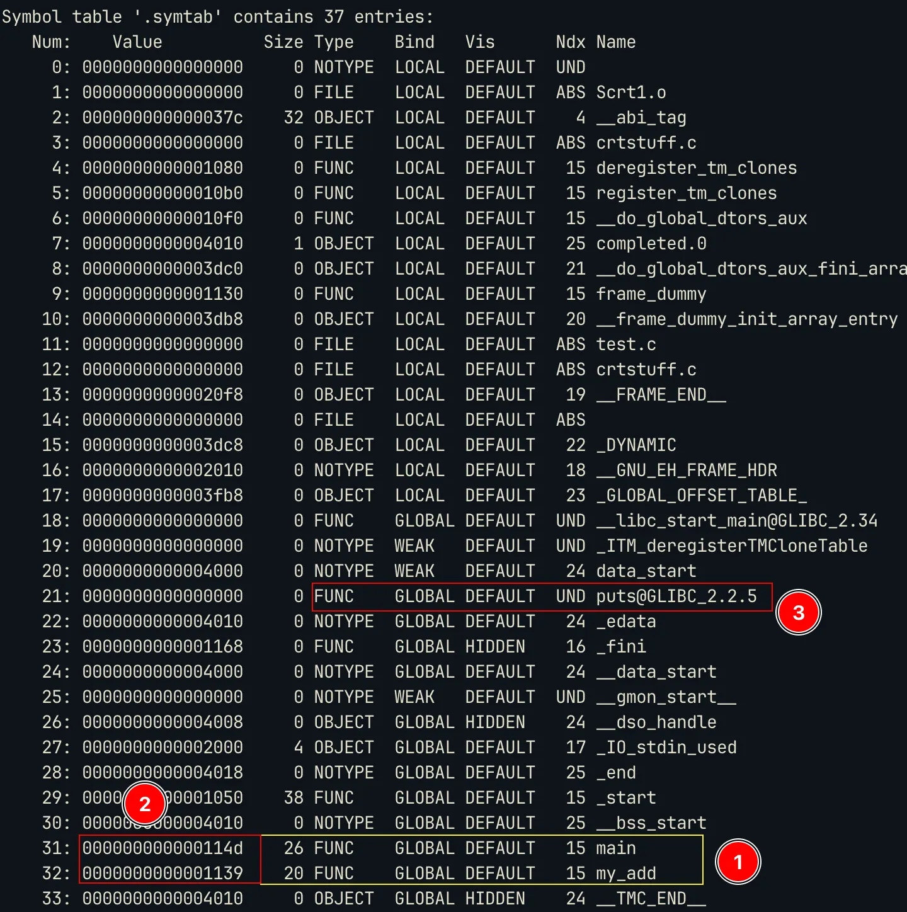

> This blog is a part of a series, you can find links to all the blogs on this page:
> [Writing a Debugger from Scratch](https://www.sheharyaar.in/blog/writing-a-debugger-00)

In the previous two blogs we managed to learn how to stop a process, inspect its registers, memories and set breakpoint. The next major task is to add breakpoints using symbol (function) names. That is a very important feature for a debugger. If you have used GDB before, it’s what `break main` or `break puts` does.

I struggled for some decent amount of time to understand the symbol resolution, effect of `Intel CET` extension, etc. So in this blog I will simplify and discuss this process from a debugger’s point of view and leave out the rest of ELF details for maybe another day or put them in my notes.

### Lets discuss Symbols (Functions)

Well, what is linking ? So, when we write programs, we often use libraries and call functions that do not belong to our code. For example, if we use `printf()` in our program, we neither declare nor define the function, we just `#include` the header.

Well the header, just contains the *declaration* and not the *definition*. We need a way to attach this function code (definition) to our compiled code. So this process is called **linking** and this is done by the linker program. In Linux its something like: `/lib64/ld-linux-x86-64.so.N` (where `N` is a number that denotes version).

Now a large number of programs use these standard functions and since `main()` is also called by *some other* function, we need to link that too. This would result in having the same library attached to so many programs, resulting in larger binary sizes, difficulty in updating the version / library code of the library, etc. and each binary would need to ship its libraries. 

> These ‘disadvantages’ are debatable and now with the easy availability of storage, some people prefer static linking, it helps to avoid this version dependency hell to have the same binary run on all Linux distributions. (Distributions like arch which are ‘rolling’ distributions often have new versions of libraries in contrast to distributions like Ubuntu. So a distributor needs to manage these version changes. Backward compatibility is fine but the issue comes when the binary has to run with a newer version of library.
> 

So to overcome these, `dynamic linking` was introduced. In this process, the library code is in a form called `Shared Object` with extension `.so` . The library code is shared among all the programs that require that version of the library. By shared I mean, they are just mapped(`mmap`) into the process’s address space.


### Memory Mappings

You can view the memory mappings of a process by reading `/proc/$(PID)/maps` file. Here is a simple example. The format for the output is:

```bash
[mem_start]-[mem_end] [perm] [offset] [dev:node] [size]    [name] 
```


The first red box denotes the permission, the maps with `x` bit set will have instructions. The last column denotes the names of the libraries mapped. As marked, the C library is mapped from address `0x700256200000` to `0x70025641c000` .

### ELF

Let’s think about this: an application usually occupies more space than its file size (even if it doesn’t use heap memory), it also has to map the instructions in the file to the memory and many more operations are needed before the program starts to run. So how does the linker or other programs involved in the starting of the program know where to read/write memory ? So to tackle this, there is a standard way of building an object file (an executable, a `.so` , or a dynamic object). This standard is call the **ELF (Executable and Linkable Format).** Repeating the theory for ELF here would not be a good idea. So for ELF theory you can look into my notes: [ELF Files](https://www.sheharyaar.in/notes/sysv-elf-dso/04-elf/).

Come back to this blog after you have understood the basic structure of an ELF file, section headers and sections. Let’s move ahead with the discussion. So for the purpose of resolving symbol names to their addresses in memory *at runtime* we are interested in the following sections: `.plt`, `.rela.dyn`, `.rela.plt`, `.symtab`, `.dynsym` and `.strtab`.Since parsing ELF is not part of the core debugging flow, I used `libelf` to perform the iteration through the section headers, symbol tables, etc.


> Out of these sections, `.plt` is the one that has the flags `AX`, here `X` means that it’s executable. You can also notice that `.symtab` and `.strtab` have no flags, that means they are not supposed to be mapped or copied to memory. Hence these can be `stripped` from the binary without affecting the binary at all. This is what `strip` program does. This makes symbol resolution *very* difficult especially, for static symbols (symbols for functions *within* the code and not library code).
> 

### Symbol Tables and String Tables

Let’s first discuss symbol tables. So if you read [elf(5)](https://man7.org/linux/man-pages/man5/elf.5.html), you will come across symbol tables. So in the previous image, `.dynsym` and `.symtab` are symbol tables of type `DYNSYM` and `SYMTAB` respectively. These symbol tables have one entry for each symbol. If you see the `Lk` column in the image (stands for Link), you will see `.dynsym` has `Lk=7` which is the index of `.dynstr` and `.symtab` has link value of `.strtab` . 

Both `.dynstr` and `.symtab` are of type `STRTAB` which means they are string tables. Since each symbol has a name, the name is stored in this *linked* string tables. Hence for symbols in `.dynsym` the names are stored in `.dynstr` and for symbols in `.symtab` names are stored in `.strtab`.

Here is a sample table entries for `.dynsym` and `.symtab` using command: `readelf -sW <file>` 




You can notice a few things:

- The `.symtab` contains the local functions (static symbols) [1] and it also has the offset address of these functions from the base of the binary [2]. So if the base is `0x55555000` then the adddress of main will be `0x55555000 + 0x01139` = `0x55556139`. But if you see the `.dynsym` the value it has is `0x0000` , this is because the offset for the *placeholder* of these dynamic symbols is given by other sections (`.rela.plt` and `.rela.dyn` , we discuss this later).
- You must also notice that *all* the symbols present in `.dynsym` are also present in `.symtab`. This means that `.symtab` is the **superset** off **all** symbol tables in the binary.

### RELA type sections

As I mentioned, the value for dynamic symbols is `0` in the symbol table. So where does the offset reside ? It resides in appropriate `RELA` sections. These sections contain the offset, the index of that symbol in the symbol table (dynsym) and the type of relocation.

> ELF defines multiple types of relocations. I only deal with `R_X86_64_JUMP_SLOT` and `R_X86_64_GLOB_DAT`. I will talk about these soon.
> 


We can notice the following:

- The entry for dynamic symbols have an `offset` value, `info` and the symbol name. This symbol name is calculated using the `info`. So the first 8 bits of `info` give you the index of the symbol in the symbol table (`.dynsym`). The symbol table will then give the address of the `name` in the string table (`.dynstr`). It’s kind of a linked list. This is how it’s done:

```c
rela_ent = rela[i];
sym_idx = ELF64_R_TYPE(rela_ent.info) // this extracts the first 8 bits
sym_ent = dynsym[sym_idx]
name_addr = sym_ent.name // this gives the address of the name
name_str = (name_addr in dynstr)
```

- If you see the dynsym image, you will notice that `puts` is at index `3` and the marker 4 in the rela image also has info `3`.
- These `offset` are usually offset of the entries in the `GOT` table or Global Offset Table.

### Relationship between the tables

For Dynamic Symbols:


For static symbols, `RELA` table is not there, so its just a simple relation between `.dynsym` and `.dynstr`. Well you may ask how do these tables know where the other is located ? The purpose of `Lk` or `Link` in the section header is to provide this.

```c
Link[rela.plt] = index_of(.dynsym)
Link[.dynsym] = index_of(.dynstr)
Link[.dynstr] = 0 // NULL;
// So it's kind of a linked list
```


### Relocation Types and how it happens

Lets talk about `R_X86_64_JUMP_SLOT` and `R_X86_64_GLOB_DAT`. 

The relocation type `R_X86_64_JUMP_SLOT` tells the linker that to resolve the address the program has to make a call to a placeholder (this address is located in the `.plt` section or in `.plt.sec` section when that is present).


Steps:

1. `puts@plt` is called. It then makes a jump to the *address* stored at GOT entry (the entry address is the program base + offset value as mentioned in `RELA` entry).
2. If the symbol is getting resolved for the first time, the address points back to the next instruction in the `plt` entry. This then calls the resolver which resolves the address and *updates* the GOT.

> So we will get the original address of the function *only* after the first call and *after* the resolver updates the GOT.
> 


Next time a call is made to `put@plt` it make jump to the updated (real) address in GOT.


For the relocations of `R_X86_64_GLOB_DAT` (usually present when `-fno-plt` is used to avoid `.plt` section. The values of these in the GOT is initially `0`. This is updated by the linker when the **program loads the library**. So how do we come to know if the value is updated or not *or* when the loaded loads a library. 

- Do we single step every time to check the value of GOT table ? That would be very slow.

So the linker provides a way for us to know when it has *started* or *completed* adding the symbols. For this we need to go to the `.dynamic` section. Since this is advanced and undocumented, I would just briefly mention this.

There is a `DT_DYNAMIC` tag entry in the `.dynamic` section. This is contains an address to the `struct r_debug` in the *tracee’s* address space. This struct is a *rendezvous* point for the debugger and the linker. This structure has a field called `r_brk` which is the address to which the debugger must add a breakpoint. The linker will execute this address every time it loads an object file. Soure: [glibc/elf/link.h](https://github.com/lattera/glibc/blob/master/elf/link.h#L48-L53). So if we as a debugger breakpoint this address, on hitting it, we can check the GOT values for the `R_X86_64_GLOB_DAT` symbols.

For `R_X86_64_JUMP_SLOT` we still need to breakpoint the `.plt` / `.plt.sec` and then single step until GOT is updated.

> `.plt.sec` is a special case when Intel CET extensions (for security) are enabled. In this case, all the PLT entries are in `.plt.sec` and they are executed. You can check more on this on the internet. This can be controlled by `-fcf-protection=none` (disables `.plt.sec`) or similar other values.
> 

### Summary

This was a information-heavy article. I would summarise some points to takeaway:

- The section headers are connected in a linked list manner.
- The dynamic symbols are present in `RELA` sections. Static symbols are present in `.symtab`. The ELF Link Chain:
    
    ```
    .rela.plt → (via sh_link) → .dynsym → .(via sh_link) → .dynstr 
    ```
    
- `.symtab` is a superset of all symbol tables. It is not present in the memory of a program, so it can be stripped without affecting the integrity of the program. 
- In cases with dynamic symbols or resolution (when not build with `-static` flag), `.dynamic` and `RELA` sections *must* be present. 
- However `.plt` or `.plt.sec` can be removed by using the `-fno-plt` flag in GCC. In this case all `R_X86_64_JUMP_SLOT` entries are converted to `R_X86_64_GLOB_DAT` and their address resolution follows the `R_X86_64_GLOB_DAT` rule as discussed (using `r_debug`).
- Method of resolution of `R_X86_64_JUMP_SLOT` and `R_X86_64_GLOB_DAT`:
    - `R_X86_64_JUMP_SLOT` : Patch the `.plt.sec` or `.plt` , then single step until GOT resolves.
    - `R_X86_64_GLOB_DAT` : Breakpoint the `r_brk` address and when it hits, check the GOT entries.

### Appendix

Here is a matrix of compilation flags, the effect they have:

- **PLT**: default
- **no-PLT**: `fno-plt`
- **CET (IBT + SHSTK)**: `fcf-protection=full`
- **Static**: `static`

| Build Flags | PLT | CET | Expected relocation | Method |
| --- | --- | --- | --- | --- |
| `-fPIE -pie -fcf-protection=none` | ✅ | ❌ | `R_X86_64_JUMP_SLOT`, `.plt`| Patch `.plt` and singlestep until GOT resolves|
| `-fPIE -pie -fcf-protection=full` | ✅ | ✅ | `R_X86_64_JUMP_SLOT`, `.plt.sec`| Patch `.plt.sec` and singlestep until GOT resolves |
| `-fPIE -pie -fno-plt` | ❌ | — | `R_X86_64_GLOB_DAT`| Breakpoint the `r_brk` address and check GOT when BP hit |
| `-static` | ❌ | ❌ | No dynamic symbols; all symbols fully resolved at link time | Add the program base to the offset |

### Resources

- [ld.so(8) manpage](https://man7.org/linux/man-pages/man8/ld.so.8.html)
- [How to Write Shared Libraries by Ulrich Drepper - PDF](https://www.akkadia.org/drepper/dsohowto.pdf)
- [ELF Specificationn - PDF](https://refspecs.linuxfoundation.org/elf/elf.pdf)
- [libelf by example - PDF](https://atakua.org/old-wp/wp-content/uploads/2015/03/libelf-by-example-20100112.pdf)
- [How GDB Loads Symbol Files - GDB](https://sourceware.org/gdb/wiki/How%20gdb%20loads%20symbol%20files)
- [All About Global Offset Table](https://maskray.me/blog/2021-08-29-all-about-global-offset-table)
- [Understanding `_dl_runtime_resolve()`](https://ypl.coffee/dl-resolve/)