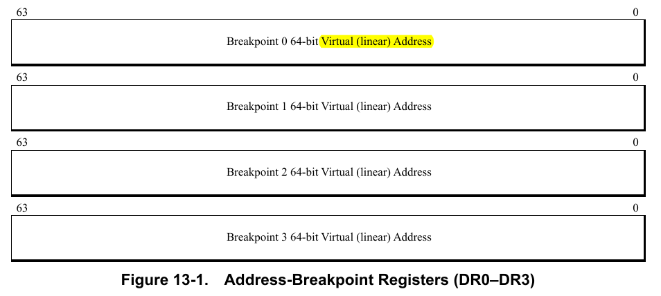

After the heavy blog on symbol resolution lets look into a lighter topic - Hardware Breakpoints and Watchpoints.

### What does a Hardware Breakpoint and Watchpoint mean ?

In case of Software Breakpoint, the only control you have is the address it hits. You don’t have the ability to place software breakpoints in these scenarios:

- When an address range is read from or written to.
- I/O happens on an I/O port.
- Task-switch occurs.
- When a program tries to access the *Debug* registers itself.
- When a bus lock happens.
- Applying breakpoint/watchpoint at an address for *all* the tasks running on a CPU.

Hardware breakpoints allow you to have breakpoints on these situations as well. Placing such hardware breakpoints on addresses to watch read/write changes is called as a **watchpoint**. For the purpose of a debugger I only discuss instruction BP and watchpoint.

## Debug Registers

Before I move on how to add/remove HW Breakpoints and Watchpoints, lets first discussed these registers.

As mentioned earlier, only `DR0` - `DR3` registers are used for HW breaking. `DR6` gives the status when a breakpoint occurs and `D7` is the register that is used to enable/disable breakpoints. `DR4` and `DR5` are not to be used by software. (Why ? Check out AMD Architecture Programmer’s Manual Vol 2 for more details).

> Historically, DR4 and DR5 were aliases for DR6 and DR7. While they can be enabled via the Debug Extensions (DE) bit in CR4, modern software treats them as reserved for compatibility. 

So, basically you put the memory address in `DR0` - `DR3` registers whichever you want, and enable Debugging for that register in `DR7`.

### Debug Registers 0 - 3

The registers `DR0` - `DR3` have the following format:



### Debug Register 6

This register gives the status of the breakpoint when one occurs. The register format is:


The first 4 bits denote the `DR[n]` which caused the breakpoint. The bits `BT`, `BS` and `BD` are out of scope of this blog, but they are related to the other features provided by Hardware Breakpoints as discussed in the start of the blog.

The debug register can be read using `PTRACE_PEEKUSER` option as described later.

### Debug Register 7

The register `DR7` is a bit complicated. It has the following format:


So it has the following important fields:

1. `LE` and `GE` are Local Enable and Global Enable (legacy) and `GD` is used to enable General Detect (as discussed earlier, it can be used to detect writes to Debug registers)

2. `L0` - `L3` and `G0` - `G3` 

Setting these to 1 basically says that you want to enable Debugging at the address stored in that particular `DR[n]` register. Here `L` means that you want debugging only for the task for which you are changing the register (the bit is cleared on task switch) and `G` means that you want debugging for *all* the tasks running on the CPU (these bits are not cleared by the processor). 

For example, let’s say you want Local debugging at address stored in `DR0` and Global debugging for address in `DR2` . So first you will load/write the address in `DR0` and `DR2`. Then you will write `1` to positions `L0` (local debug at DR0) and `G2` (global debug at DR2). The exact way to set these is explained later.

3. `R/W[n]` and `LEN[n]` : 

These are what separates instruction BP and watchpoint. The rules is as follows:

- For instruction breakpoints, the `R/W` (2-bits) should be `00` and `LEN` bit should also be `00`.
- For watchpoints, `R/W` denote the type of access you want to detect, `01` for *data write* and `11` for **both** read or write. There is no read-only access to detect (you can just compare the old value which you have to save before placing the breakpoint to the new one). The case `10` is used for *I/O read* and *I/O writes*, it also checks value in `CR4` register which is out of scope for this blog. The `LEN` denotes the number of bytes to detect access from the address in the `DR[i]` register.

So it can be summarised as:

```asm
R/W[i]:
	00 - Instruction BP
	01 - Write Only
	10 - I/O RW (out of scope)
	11 - Read or Write
Len[i]:
	00 - Instruction BP
	01 - 2 byte, must be aligned on _word_ boundary
	10 - 8 bye, aligned on _quadword_ boundary
	11 - 4 byte, aligned on _doubleword_ boundary
```
> The alignment clause is very important. If the address is not aligned as required, the behaviour may be undefined or the breakpoint may not get triggered.


Let’s walk through an example, if we want to set instruction breakpoint at address `0xbreak` , 2-byte (write only) watchpoint at address `0x2rwatch` and 8-byte r/w watchpoint on `0x8watch` . This will be the values of the registers:

```asm
DR0 - 0xbreak
DR1 - 0x2rwatch
DR2 - 0x8watch

DR7:
	- L0 - enable, R/W0 - 0b00 (instr)
	- Len0 - 0b00 (instr)
	- L1 - enable
	- R/W1 - 0b01 (write only)
	- Len1 - 0b01 (2-byte) [check address alignment first]
	- L2 - enable
	- R/W2 - 0b11 (r/w)
	- Len2 - 0b10 (8-byte) [check address alignment first]
```

### Setting the values of the registers

In [Part 2](https://www.sheharyaar.in/blog/writing-a-debugger-02), I discussedto about the process to get and set Debug registers for the tracee (`PTRACE_PEEKUSER` and `PTRACE_POKEUSER`). Let’s get into the details. Let me quote the manpage:

> Read a **word** at **offset** `addr` in the tracee's USER area
> 

It says that this options helps us to read a `word` (8 bytes in 64-bit Linux) at an `offset` inside the `USER` area (i.e `struct user`). The struct is as follows ([source](https://github.com/bminor/glibc/blob/master/sysdeps/unix/sysv/linux/x86/sys/user.h#L73-L98)):

```c
struct user
{
  struct user_regs_struct	regs;
	...
  __extension__ unsigned long long int	start_code;
  __extension__ unsigned long long int	start_stack;
  __extension__ long long int		signal;
  ...
  __extension__ unsigned long long int	u_debugreg [8];
};
```

So we need to get the address at which the debug register is located in the `u_debugreg[8]` array. Well it’s not complicated. Let’s say we want to get the address of the `DR[i]` register where `i` is one of `0-7`. So the address of `u_debugreg` will be: `offsetof(struct user, u_debugreg)` and to get the entry at index `i` it will be `i * sizeof(unsigned long long)` . So the call would be:

```c
// get the value
addr = offsetof(struct user, u_debugreg) + i * sizeof(unsigned long long);
val = ptrace(PTRACE_PEEKUSER, pid, addr, 0);

// set the value (this can be used to set DR0-DR3 values)
val = 0xaddress;
ptrace(PTRACE_POKEUSER, pid, addr, val);
```

For setting `DR7` we would need some effort. Let’s say we need to enable debug register `i` with `R/W` value `rw` and `Len` value as `len` . So to we would need to first fetch the original DR7 value to avoid clearing old breakpoints. So we would need to do the following calculations:

```c
// 1. First we find an expression to set L[i]. You can see that L[i] values
// are at position 0, 2, 4 and 6 (these are equal to 2*i) where i=0,1,2,3.
// So we need to do this bitshift:  (1 << 2*i), then we need to set this in DR7
dr7_new_1 = (dr7_orig | (1 << 2*i));
// If we make it a macro
#define DR7_SET_LOCAL(dr7, idx) (dr7 | (1 << 2*idx))

// 2. Now we find an expression to set R/W value. These are present at position
// 16-17, 20-21, 24-25, 28-29 which can be written as 16 + (4*i) and the next pos
// So we need to bitshift the two-byte: (rw << (16 + 4*i))
dr7_new_2 = (dr7_new_1 | (rw << (16 + 4*i)));
#define DR7_SET_RW(dr7, rw, idx) (dr7 | (rw << (16 + 4*idx)))

// 3. Similarly for LEN positions are 18-19, 22-23 and so on which can be also
// written as (18 + (4*i))
dr7_new_3 = (dr7_new_3 | (len << (18 + 4*i)));
#define DR7_SET_LEN(dr7, len, idx) (dr7 | (len << (18 + 4*idx)))
```

So to enable (**write-only, 8-byte watchpoint**, at **0x1234**) the pseudo-code will be:

```c
// from previous snippet
#define DR_OFFSET(idx) (offsetof(struct user, u_debugreg) + idx * sizeof(long))
#define DR7_CLEAR_RW(dr7, idx) (dr7 & ~(0b11 << (16 + 4*idx)))

// write the address to DR0
addr = 0x1234;
ptrace(PTRACE_POKEUSER, pid, DR_OFFSET(0), addr);

dr7_orig = ptrace(PTRACE_PEEKUSER, pid, DR_OFFSET(7), 0);
// set L0
dr7 = DR7_SET_LOCAL(dr7_orig, 0);
// IMP: its often better to first clear these bits to avoid old bits to interfere
// let's say it already had 0b01, we OR 0b10, it becomes 0b11 which is incorrect.
dr7 = DR7_CLEAR_RW(dr7, 0);
// set R/W0 as 0b01 (w only). We use the changed dr7 since we want all the effect to combine
dr7 = DR7_SET_RW(dr7, 0b01, 0);
// Clear these bits also, omitted here
// set LEN0 as 0b10 (8 byte)
dr7 = DR7_SET_LEN(dr7, 0b10, 0);
// write the register
ptrace(PTRACE_POKEUSER, pid, DR_OFFSET(7), dr7);

/* ---- on breakpoint ---- */
// read DR6
long status = ptrace(PTRACE_PEEKUSER, pid, DR_OFFSET(6), 0);
for (int i=0; i<4; i++) {
	// check the i-th bit from LSB
	if ((status >> i) & 0x01) == 1) {
		// this is the register that caused the breakpoint
	}
}
```

### Resources

- AMD Architecture Programmer’s Manual Vol 2, Debugging Chapter
- [Notes on Hardware Breakpoints and Watchpoints](https://aarzilli.github.io/debugger-bibliography/hwbreak.html)