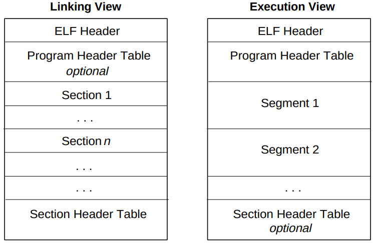

import { Aside } from "@astrojs/starlight/components";

TODO: Create manim videos / GIFs to explain the binary to ELF conversion and other concepts like
segment-section mapping. Add the GIFs/videos as TabItems in the tab with the source code.

<Aside type="note">
    The notes below is based on the Tool Interface Standard (TIS) and Executable and Linking Format (ELF)
    Specification Version 1.2 — TIS Committee, May 1995. Also the notes make reference to dynamic linking
    concepts like the Hash Symbol Table, etc. So it is better to get a basic idea on how dynamic linking
    works.
</Aside>

Object files have different Views / Layout for a file that is participating in `linking` and a different for
`execution`. Both have the ELF header which describes the file.



|                      |                                                                                                                                                       |
| -------------------- | ----------------------------------------------------------------------------------------------------------------------------------------------------- |
| ELF Header           | Describes the layout of the File. _Only_ this header has a **fixed** position (beginning) in the file, other sections or segments can be in any order |
| Program Header Table | Tells the system how to create the `process image`. This is mandatory for executables, and optional for shared objects.                               |
| Section Header Table | Gives information about the type, size and the location of different sections. This is optional in executables and mandatory in shared objects.       |
| Section              | Hold the bulk of information of the shared / link object — instructions, data, symbol tables, relocation information.                                 |
| Segment              | Collection of sections that are loaded into memory.                                                                                                   |

To avoid repeating good articles and the man page, I won’t go into the detailed discussion of each field. I
will discuss the ones that I feel are relevant and important for Dynamic Linking and execution of a program.

### ELF Header

From the manpage and ELF spec, the header has the following C structure, the fields are usually aligned to 4
bytes:

```c
#define EI_NIDENT 16

// N denotes the bit, 32 for 32-bit, 64 for 64-bit
typedef struct {
	/*
		e_ident:
			EI_MAGIC0 - EI_MAGIC3 (Magic bytes) : 7xf, 'E', 'L', 'F'
			EI_CLASS - ELFCLASSNONE (0), ELFCLASS32 (1), ELFCLASS64 (2)
			EI_DATA - ELFDATANONE (0), ELFDATA2LSB (1), ELFDATA2MSB(2)
			EI_VERSION - EV_CURRENT
			EI_OSABI - ELFOSABI_LINUX, etc.
			EI_ABIVERSION -
			EI_PAD - Pad Bytes
	*/
	unsigned char e_ident[EI_NIDENT];
	/*
		Type of obj file = ET_NONE(0), ET_REL (1), ET_EXEC(2),
		ET_DYN(3), ET_CORE(4), ET_LOPROC(0xff00), ET_HIPROC (0xffff)
	*/
	uint16_t      e_type;
	// Machine Info: EM_X86_64 (0x003e) for AMD x86-64, etc. See elf(5).
	uint16_t      e_machine;
	uint32_t      e_version;
	// Virtual address to which the system transfers control (to start the process).
	ElfN_Addr     e_entry;
	// Program header offset in bytes from the start of the file/
	ElfN_Off      e_phoff;
	// Section header offset in bytes from the start of the file.
	ElfN_Off      e_shoff;
	// Processor specific flags - EF_*
	uint32_t      e_flags;
	// ELF Header size in bytes
	uint16_t      e_ehsize;
	// Size per entry of the program header
	uint16_t      e_phentsize;
	// Number of entries, upto a maximum of 0xffff, if more, the real value is
	// present in sh_info. See elf(5).
	uint16_t      e_phnum;
	// Section header entry size
	uint16_t      e_shentsize;
	// Number of entries in section header
	uint16_t      e_shnum;
	// Section header table index of the entry associated
	// with section name string table.
	uint16_t      e_shstrndx;
} ElfN_Ehdr;
```

## Program Headers

Program headers are meaningful only for executables and shared object files, because, these describe
`segments` / other information required to prepare the program for execution. Each segment contains one or
more `sections`.

```c
/* Program Header */
typedef struct {
	/*
	The type of segment this program header describes:
	PT_NULL - Unused, ignored.
	PT_LOAD - loadable segment, described by `p_filesz` and `p_memsz`, appear in
	          ascending order, sorted on `p_vaddr` field.
	PT_DYNAMIC - Dynamic Linking information, read later sections for details.
	PT_INTERP - Null-terminated pathname of the interpreter.
	PT_NOTE - Location for Notes
	PT_SHLIB - Reserved but unspeicifed.
	PT_HDR - If present, specifies location and size of the program
	         header itself.
	PT_GNU_STACK - GNU Extension used by Linux Kernel to control the state
	               state of the stack via p_flags.
	*/
	uint32_t   p_type;
	// Bitmask of relevant segment - PF_X, PF_W, PF_R (Execute, Write and Read)
	uint32_t   p_flags;
	// Offset in bytes from the start of file to the first byte of the segment.
	Elf64_Off  p_offset;
	// Virtual Address of the segment's first byte
	Elf64_Addr p_vaddr;
	// Physical Address of the segment's first byte (for systems
	// with physical addressing).
	Elf64_Addr p_paddr;
	// Size in bytes in the file image
	uint64_t   p_filesz;
	// Size in bytes in the memory image
	uint64_t   p_memsz;
	// Value to which the segment is aligned
	uint64_t   p_align;
} Elf64_Phdr;
```

## Sections

### Section Header

The section header table is an `array` of `struct Elf46_Shdr` that helps one to locate all the sections in the
file.

-   A section header table index is a subscript into this array. Some section header table indices are
    reserved — the initial entry and indices between `SHN_LORESERVE` and `SHN_HIRESERVE` . An object files
    does not have sections for these special indices:
    -   `SHN_UNDEF` - undefine / irrelevant / missing or meaningless section
    -   `SHN_LORESERVE`, `SHN_HIRESERVE` - lower and upper bound of reserved indices
    -   `SHN_LOPROC`, `SHN_HIPROC` - Values in the range `[SHN_LOPROC, SHN_HIPROC]` is reserved for processor
        semantics.
    -   `SHN_ABS` - Absolute value for the reference. Eg - a symbol defined relative to section number
        `SHN_ABS` has an absolute value and is not affected by relocation.
    -   `SHN_COMMON` - Common symbols, like unallocated C external variables.

```c
/* Section Header */
typedef struct {
	// Name of the section, since its an uint, the value here is the index to the
	// section header string table section, which gives the location of
	// NULL-terminated string.
	uint32_t   sh_name;
	/* Section's content:
		SHT_NULL - Inactive section
		SHT_PROGBITS - Section holds info defined by the program
		SHT_SYMTAB - Holds symbol table
		SHT_STRTAB - Section holds a string table, can be multiple such sections
		SHT_RELA - Relocation offset _with_ explicit addends
		SHT_HASH - Symbol Hash Table, used in Dynamic Linking
		SHT_NOTE - Section holds notes
		SHT_NOBITS - Occupies no space on the file.
		SHT_REL - Relocation offset _without_ explicit addends ??
		SHT_SHLIB - unspecified semantics
		SHT_DYNSYM - Minimal set of Dynamic Linking symbols
		...
	*/
	uint32_t   sh_type;
	// SHF_WRITE, SHF_ALLOC, SHF_EXECINSTR, SHF_SHF_MASKPROC (Processor spec) and
	// more. Some are not yet documented in the man page.
	uint64_t   sh_flags;
	// If non-zero, contains the address at which the first byte of the segment
	// should be present in the _memory_ image
	Elf64_Addr sh_addr;
	// Offset from the beginning of the file to the first byte of the section
	Elf64_Off  sh_offset;
	// The size of section in bytes in the _file_
	uint64_t   sh_size;
	// Section header table index link
	uint32_t   sh_link;
	// Extra info
	uint32_t   sh_info;
	// alignment required by the section, 0/1 means no constraint,
	// power of two values give the alignment constraint
	uint64_t   sh_addralign;
	// entry size of fields if the section contains multiple entries - like a
	// symbol table
	uint64_t   sh_entsize;
} Elf64_Shdr;
```

### Important Sections in the ELF File

| Name                        | Description                                                                                                                       | Section Type                                              | Attribute Type                                                                        |
| --------------------------- | --------------------------------------------------------------------------------------------------------------------------------- | --------------------------------------------------------- | ------------------------------------------------------------------------------------- |
| **.bss**                    | Uninitialised data that contributes to program’s memory image, initialised to zeros when program runs.                            | `SHT_NOBITS`                                              | `SHF_ALLOC`, `SHF_WRITE`                                                              |
| **.text**                   | Contains executable instructions of the program                                                                                   | `SHT_PROGBITS`                                            | `SHF_ALLOC` , `SHF_EXECINSTR`                                                         |
| **.data, .data1**           | Initialised data which contribute to memory                                                                                       | `SHT_PROGBITS`                                            | `SHF_ALLOC`, `SHF_WRITE`                                                              |
| **.rodata, .rodata1**       | Read only data , that contributes to nonwritable segment.                                                                         | `SHT_PROGBITS`                                            | `SHF_ALLOC`                                                                           |
| **.init, .fini**            | Initialisation and termination code                                                                                               | `SHT_PROGBITS`                                            | `SHF_ALLOC`, `SHF_EXECINSTR`                                                          |
| **.got, .plt**              | Holds the global offset table / procedure linkage table                                                                           | `SHT_PROGBITS`                                            | Processor specific                                                                    |
| **.symtab**                 | Symbol table                                                                                                                      | `SHT_SYMTAB`                                              | `SHF_ALLOC` if the loadable segment has symbol table.                                 |
| **.debug**                  | Holds information for symbol debugging                                                                                            | `SHT_PROGBITS`                                            | None                                                                                  |
| **.interp**                 | Holds the pathname of program interpreter                                                                                         | `SHT_PROGBITS`                                            | `SHF_ALLOC`                                                                           |
| **.hash**                   | Symbol hash table used in dynamic linking                                                                                         | `SHT_HASH`                                                | `SHF_ALLOC`                                                                           |
| **.dynamic**                | Holds dynamic linking information                                                                                                 | `SHT_DYNAMIC`                                             | `SHF-ALLOC` but `SHF_WRITE` depends on the processor                                  |
| **.dynstr**                 | Strings needed for dynamic linking                                                                                                | `SHT_STRTAB`                                              | `SHF_ALLOC`                                                                           |
| **.dynsym**                 | Dynamic Linking symbol table                                                                                                      | `SHT_DYNSYM`                                              | `SHF_ALLOC`                                                                           |
| **.line**                   | Line number information for symbol debugging                                                                                      | `SHT_PROGBITS`                                            | None                                                                                  |
| **.note.\***                | Holds various notes                                                                                                               | `SHT_NOTE` / `SHT_PROGBITS` depending on the section name | Depends on the section name. See elf(5).                                              |
| **.rel*Name*, .rela*Name*** | Contains relocation information, the _Name_ is given by the section to which relocations apply, like `.rel.text` or `.rela.text`. | `SHT_RELA`                                                | `SHF_ALLOC` if the relocation segment is loadable                                     |
| **.shstrtab**               | Holds sections names.                                                                                                             | `SHT_STRTAB`                                              | None                                                                                  |
| **.strtab**                 | Strings, commonly associated with symbol table entries                                                                            | `SHT_STRTAB`                                              | If the file has loadable segment that includes symbol string table, then `SHF_ALLOC`. |

### Other important structures

1. Symbol and String tables — address of name, value, size, type of binding (info), symbol visibility.
2. Relocation Tables (Rel, Rela) — gives the offset, info (symbol table index wrt which relocation must be
   made and the type of relocation) and addend (in case of `rela`).
3. Dynamic Tags (DYN) — dynamic tag and value / pointer (virtual address). The tag can be such as : `DT_HASH`,
   `DT_RELA`, `DT_INIT`, `DT_FINI` , etc. which may give the Virtual address of such table / table entry /
   functions, etc. Some other commonly used tags are: `DT_NEEDED`, `DT_SONAME`, `DT_RUNPATH`, `DT_SYMTAB`,
   `DT_STRTAB`, `DT_GNU_HASH`.

For more information, please refer to the ELF manpage in the resources below.

## Resources

-   https://medium.com/@dassomnath/handcrafting-x64-elf-from-specification-to-bytes-9986b342eb89
-   https://man7.org/linux/man-pages/man5/elf.5.html
