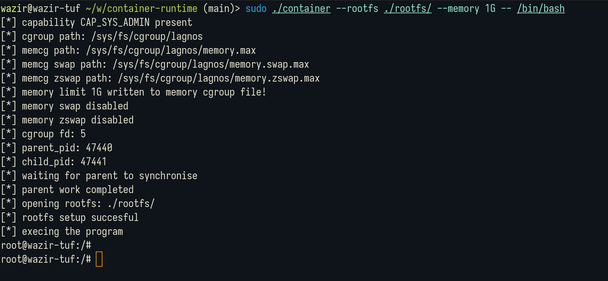

In this project, I dive deeper into Linux container primitives and I attempt to create a low-level container runtime with the following features :

- Running a program in a new User, PID, Network and IPC namespace.
- Rootfs support
- UID and GID mapping from host to container
- Cgroup memory limiting

You can find the implementation notes at my [notes collection](../notes/linux-containers). I have also written a short [blog](../blog/container-runtime) writing down my learning experience, pitfalls and the issues that I faced.