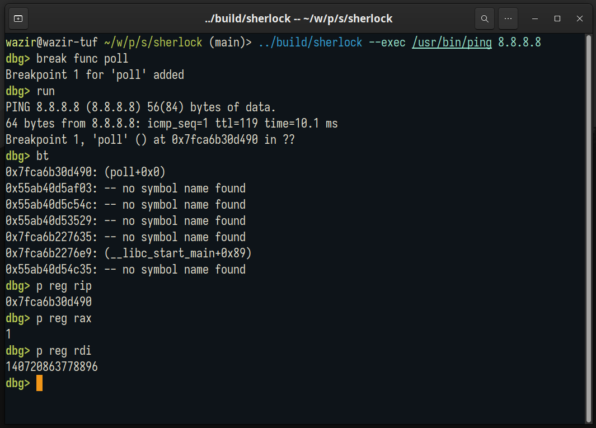

In this project I dive into ELF, System V ABI, Linux ptrace system call, GDB source code and much more to develop a collection of tools - a syscall tracer (watson), a library tracer (irene) and a debugger (sherlock).